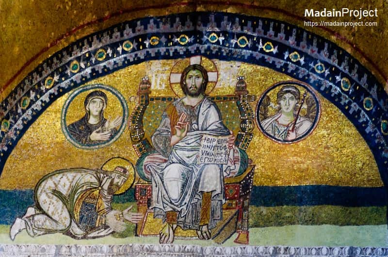

# Tessera

> Permanent tiles for a permanent mark.

A web-based QR code generator built for **permanence**. Designed for one specific use case — generating a QR code that will be tattooed and must work for life — but useful for anyone who wants verifiably correct, archival-grade QR codes.

**Live at <https://tessera-neon.vercel.app/>** · **Source: <https://github.com/MaximilianWik/Tessera>** · **Test page: <https://tessera-neon.vercel.app/tests.html>**

## About the name

A *tessera* (plural *tesserae*) is one of the small stone or glass tiles set into a mosaic. The Romans floored their villas with them. Byzantine craftsmen tiled the dome of Hagia Sophia with gold-leaf tesserae that have caught the light for fifteen hundred years; the mosaics at Ravenna are nearly as old and still readable.

<p align="center">
  
  <br>
  <em>Detail from the Hagia Sophia mosaics. Each tile is a tessera; the picture only exists because all of them are still there.</em>
</p>

A QR code is a mosaic. Each module is a tessera; the message is the picture they make together. Fitting name for a mark designed to outlast you — assembled from small tiles, intelligible only when all of them survive in the right places.

## Why does this exist?

Every commercial QR generator I've seen is a black box. You paste a URL, it spits out a PNG, and you're supposed to trust it. That's fine if you're printing it on a flyer that gets thrown away next week. It's not fine if you're going to ink it into your skin.

Tessera is built so the correctness of every QR it generates can be **verified independently, by you, by anyone, forever**.

## How it's permanent

Correctness is treated as a multi-layered problem. Every layer must independently verify the QR is sound.

1. **The format itself is permanent.** QR is [ISO/IEC 18004](https://www.iso.org/standard/62021.html), with trillions deployed. Every iPhone since iOS 11 (2017) and every Android since 2019 auto-detects QR in the native camera. The standard hasn't changed in ways that affect decoding since 2000. Phones will read QR codes for the rest of your life.

2. **Spec-compliance, mathematically verified.** The encoder is checked against the **ISO/IEC 18004 Annex I worked example** — the spec's own published test case. Tessera's output must match bit-for-bit. If this passes, the encoder agrees with the standard itself.

3. **Round-trip decoding by multiple independent decoders.** Every QR Tessera produces is automatically decoded back to text before you can download it, using:
   - [jsQR](https://github.com/cozmo/jsQR) — popular open-source JS decoder
   - [zxing-js](https://github.com/zxing-js/library) — port of the canonical ZXing decoder used in Android ML Kit
   - The browser's native [`BarcodeDetector`](https://developer.mozilla.org/en-US/docs/Web/API/BarcodeDetector) where available — on Chrome/Edge this is the same OS-level decoder phones use.

   Verification passes iff at least 1 decoder successfully decoded the QR AND every decoder that succeeded returned the exact original input text. (A decoder *silently returning wrong text* fails verification immediately — that's the dangerous failure mode.) The UI shows a "redundancy level" indicating how many decoders independently agreed.

4. **Damage tolerance simulation.** Each QR is stress-tested by overlaying a random square "blot" covering 5–30% of the module area and re-decoding. (Clustered damage, not random module flips — see [docs/PERMANENCE.md](docs/PERMANENCE.md) for why this matches real-world failure modes.) The empirical permanence bar is **5% clustered damage tolerated reliably**; larger QRs typically tolerate considerably more — your QR's actual measured tolerance is shown in the UI and printed on the spec sheet.

5. **Multi-format archival output.** The generator produces a printable **specification sheet** containing the QR at multiple physical sizes, the encoded URL in plain text, version/EC/mask metadata, generation timestamp, the **full module matrix as ASCII art and hex dump** (so the QR can be reconstructed by hand from a printed copy if all digital files are lost), SHA-256 of the source code that generated it, round-trip results, and reproduction instructions.

6. **Open-source auditability.** The repo is public. Anyone can audit the encoder, run the tests, and verify your QR was correctly generated.

For the full write-up, see [docs/PERMANENCE.md](docs/PERMANENCE.md).

## Architecture

**100% client-side static site, no build step, no runtime dependencies.**

- All QR generation happens in the browser (vanilla JS, plain `<script>` tags — no modules, no bundler)
- Vercel serves static files from this repo (free hobby tier)
- No server, no serverless functions, no database
- The decoders for round-trip verification are **vendored** (committed source) — no supply chain risk, no external network calls
- Will work unchanged on any future browser that follows web standards

## Running locally

You can just **double-click `index.html`** — it works. No server needed.

If you prefer a local server (e.g. to test exactly what Vercel will serve):

```sh
# Any of these work — Tessera doesn't care which
npx --yes http-server -p 8080 -c-1 .
python3 -m http.server 8080
ruby -run -e httpd . -p 8080
```

Then open `http://localhost:8080/`.

## Running the tests

Open `tests.html` in a browser. The full suite runs and reports results. This page is also deployed alongside the app, so anyone visiting `/tests.html` can verify the deployed code passes its own tests.

The tests include:

- **ISO/IEC 18004 Annex I worked example** — must match the spec's published expected output bit-for-bit.
- **Internal consistency** — encoder output passes its own round-trip decode through every available decoder.
- **Damage tolerance** — encoder output decodes correctly with up to 5% clustered damage (the empirical floor across QR sizes; larger QRs tolerate considerably more).
- **Edge cases** — empty input rejection, URL boundary cases, all-numeric, all-alphanumeric, bytes/UTF-8.

## Deployment

The canonical deployment is at <https://tessera-neon.vercel.app/>. To run your own instance:

1. Fork [the repo](https://github.com/MaximilianWik/Tessera) on GitHub.
2. Import the fork at <https://vercel.com/new>. Vercel auto-detects the static site — leave Framework Preset as "Other" and Build Command / Output Directory blank.
3. Click Deploy. First deploy takes ~30 seconds.
4. (Optional) Add a custom domain in Vercel's **Settings → Domains**; it issues a Let's Encrypt cert automatically.

CI runs the full browser test suite on every push (`.github/workflows/ci.yml`); deploys are gated on those tests passing.

### What if Vercel ever goes away?

Tessera is a static site with zero runtime dependencies. The same files work on GitHub Pages, Cloudflare Pages, Netlify, any nginx/Apache/Caddy server — or simply by opening `index.html` from disk. There are no `fetch()` calls or anything else that requires a server. This was an explicit design constraint.

### Domain considerations for a tattoo

If the QR points to a URL on a domain you control, **renew the domain forever**. Set up 10-year renewals with auto-renewal at every registrar that allows it, multiple payment methods on file, and a note in your will / instructions to next-of-kin. If the URL ever 404s, the QR still scans correctly — it just leads nowhere; you can also encode a payload that doesn't depend on a server (e.g. a `mailto:`, plain text, or a data URI — though those have practical limits).

## Repo layout

```
tessera/
├── index.html              # Main app
├── tests.html              # Browser test runner
├── styles.css              # Styling
├── src/                    # Encoder, decoders orchestration, UI
├── vendor/                 # Vendored decoders (jsQR, zxing-js)
├── tests/                  # Test fixtures and runners
├── docs/                   # PERMANENCE, SPEC
├── .github/workflows/ci.yml
├── package.json            # Dev convenience only — zero runtime deps
├── vercel.json
├── README.md
├── CHANGELOG.md
└── LICENSE
```

## What Tessera does NOT claim

- It does **not** claim "100% guaranteed forever." Nothing is.
- It claims: *verified correct against the ISO spec's own test vectors, round-trip-tested by up to three independent decoders (with the redundancy level recorded), damage-tolerant in a clustered-blot stress test (with the actual measured tolerance recorded for every QR), and open-source auditable.* That's the strongest honest claim possible — and it's stronger than any commercial QR generator offers.

## License

MIT — see [LICENSE](LICENSE).
